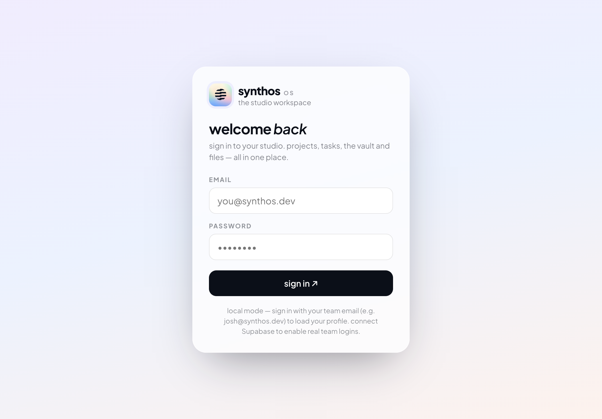
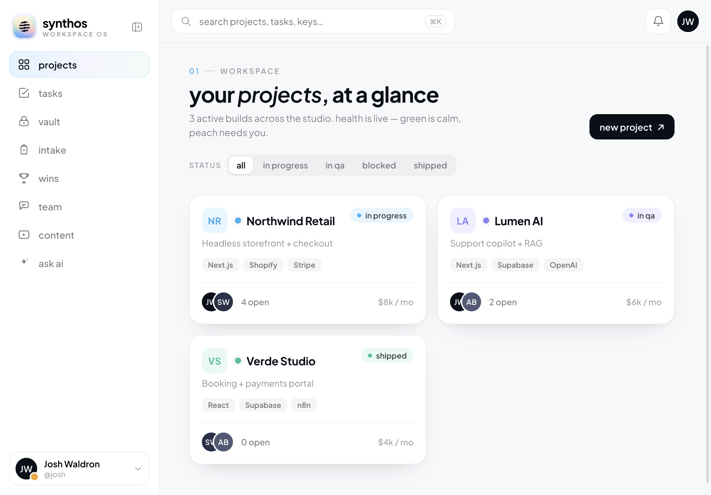
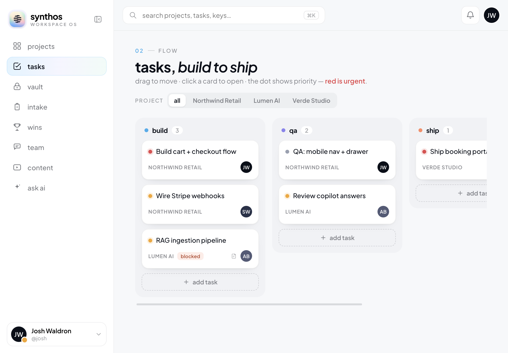
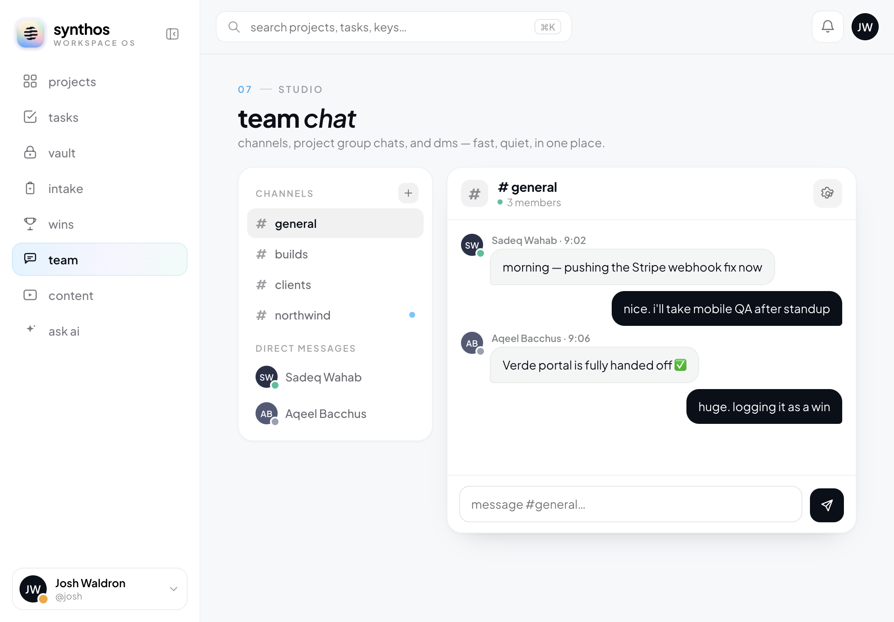
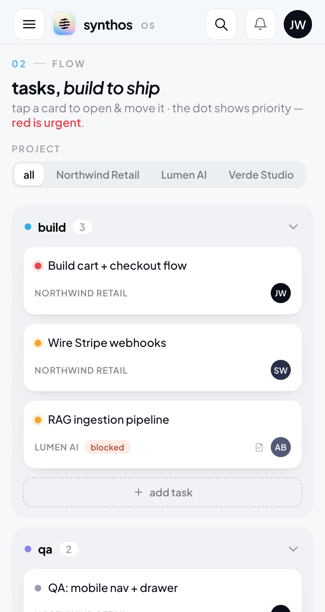

# Synthos OS

**The studio workspace — one calm place to run a small software/AI studio.**

Synthos OS is an internal operating system for a small product/automation team. Projects, tasks, content, secrets, revenue, and team chat usually live scattered across Notion, Trello, a password manager, and Slack. Synthos OS pulls them into a single, fast, installable workspace so a 3-person studio can see everything — what's shipping, what's blocked, and where revenue stands — at a glance.

It's an installable **PWA** (works offline, adds to your home screen, sends push notifications) and runs fully client-side out of the box, with a data layer ready to flip to Supabase for a shared, real-time backend.

🔗 **Live demo:** [synthos-os.vercel.app](https://synthos-os.vercel.app) — sign in with any team email (e.g. `josh@synthos.dev`) and any password; each visitor gets their own sandbox.

<p align="center">
  
</p>

---

## Why I built it

Small studios don't need heavyweight enterprise tooling — they need one opinionated surface that answers "what's the state of the studio right now?" without context-switching across five tabs. Synthos OS started as a high-fidelity design and became a real product: a responsive, mobile-first workspace that's pleasant to use on a laptop during a build session and on a phone between meetings.

It's also a showcase of building a polished, production-shaped SPA: thoughtful state management, a clean local-first architecture that upgrades to a real backend, true responsive design, and PWA installability — all deployed with CI/CD.

---

## Screenshots

| Projects portfolio | Tasks kanban |
| --- | --- |
|  |  |

**Team chat** — channels, project rooms, and DMs with live presence:



**Mobile** — every board collapses into a single-scroll, tap-to-expand layout, with a bottom tab bar and slide-in nav:

<p align="center">
  
</p>

---

## Features

- **Projects** — portfolio of client builds with status, health, stack, linked tools (repo / Vercel / Supabase), per-project tasks, files, monthly retainer + earned revenue, and editable details.
- **Tasks** — drag-and-drop kanban (build → qa → ship → done) with inline rename, priority, assignee, blocked flags, notes, and a quick-add composer. Filterable by project.
- **Content pipeline** — kanban for content from *idea* to *posted*, with per-card AI assists (hook / script / repurpose).
- **Vault** — masked secrets with reveal/copy, "copy as .env", and a full audit log.
- **Intake** — paste a client scope and generate draft tasks auto-balanced across the team.
- **Wins** — a celebratory feed that rolls up milestones and revenue.
- **Team** — channels, project group chats, and DMs with live presence indicators.
- **Ask AI** — an assistant surface grounded in your workspace (wire to a real model via env).
- **Search** — ⌘K across projects, tasks, keys, and people.
- **Profiles & settings** — editable name, username, role, GitHub, bio, avatar, status, and notification preferences.
- **PWA** — installable, offline-capable, push notifications, and iOS safe-area aware.
- **Responsive** — purpose-built mobile layouts (bottom tabs, slide-in drawer, bottom-sheet modals, stacked collapsible boards).

---

## Tech stack

- **React 19** + **TypeScript** + **Vite**
- **Zustand** for state (with `persist` to localStorage)
- **React Router** for routing
- **vite-plugin-pwa** (Workbox) for the service worker, manifest, and offline caching
- **Supabase-ready** data-access layer (Postgres, Storage, Auth) — toggled on by env vars
- **Vitest** for unit tests, **Oxlint** for linting
- Deployed on **Vercel** with GitHub CI/CD

## Architecture

Synthos OS is **local-first**. With no backend configured it runs entirely on `localStorage` + IndexedDB, so the demo is instant and every visitor gets an isolated sandbox. The data access is abstracted behind a repository layer: set `VITE_SUPABASE_URL` and `VITE_SUPABASE_ANON_KEY` and the same UI flips to a shared Supabase backend (Postgres for data, Storage for files, Auth for real team logins) with no component changes.

## Getting started

```bash
npm install
npm run dev        # start the dev server (http://localhost:5173)
```

Other scripts:

```bash
npm run build      # type-check + production build
npm run preview    # preview the production build
npm test           # run unit tests
npm run lint       # lint
```

### Optional: connect Supabase

Copy `.env.example` to `.env` and fill in your project credentials:

```bash
VITE_SUPABASE_URL=your-project-url
VITE_SUPABASE_ANON_KEY=your-anon-key
```

Without these, the app stays in fully-functional local mode.

## Deployment

Deployed on Vercel as a Vite SPA (config in `vercel.json`). Every push to `main` triggers an automatic production deploy at [synthos-os.vercel.app](https://synthos-os.vercel.app).
